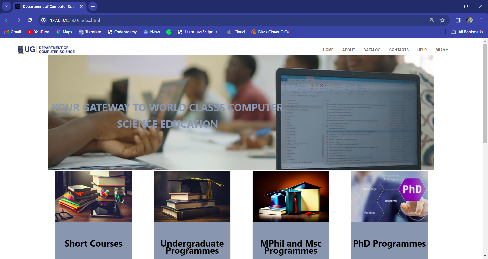

# DCIT_205_IA

## Name

    Melvin Kwabena Kwakye King

## Student ID

    11024275

## About

    This project is based on an Interim Assignment to create a website of the Computer Science Department.

## Set-Up

    To work on this project, the following steps were taken:

    -> With the the use of the git terminal on my computer I cloned the DCIT_205_IA repository with the command:
         'git clone https://github.com/Orpxollem/DCIT_205_IA.git' into a selected location on my computer.

    -> After cloning the repository, I forked the repository as requested to enable me to be able to make changes to my files without affecting the files in the main repository.

    -> All files will be updated as I work on this project into the forked repository of the DCIT_205_IA repository and on completion of the project a pull request will be made to upload all my final files to the main repository

## Things Learnt From The Project

    -> I gained more knowledge on positioning more items on an html page using style elements such as 'margin', 'padding', position and display

    -> I gained insight on how to add animation effects to texts and images on hover initiation

    -> I learnt that css properties will have to be added to an html document to specify the look of a webpage when the page sized is reduced into mobile view, as it is not done automatically by the wweb browser

## Screenshots

### Home Page (index.html)

#### Hover Views

### About Page (about.html)

### Catalog Page (catalog.html)

#### Hover Views

### Footer Hover View

### Contacts Page (contacts.html)

### Help Page (help.html)

### Resources Page (resources.html)

### Events Page (events.html)

### Alumni Page (alumni.html)

### Insight & Job Opportunities Page (Index.html)

### Technology News & Update Page (Index.html)

### "More" Menu View

